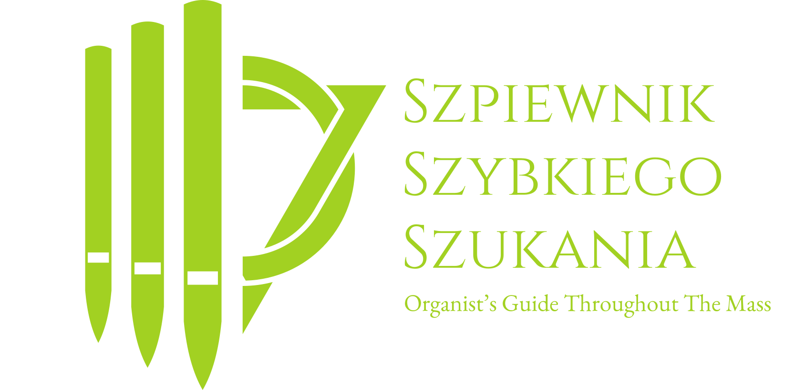
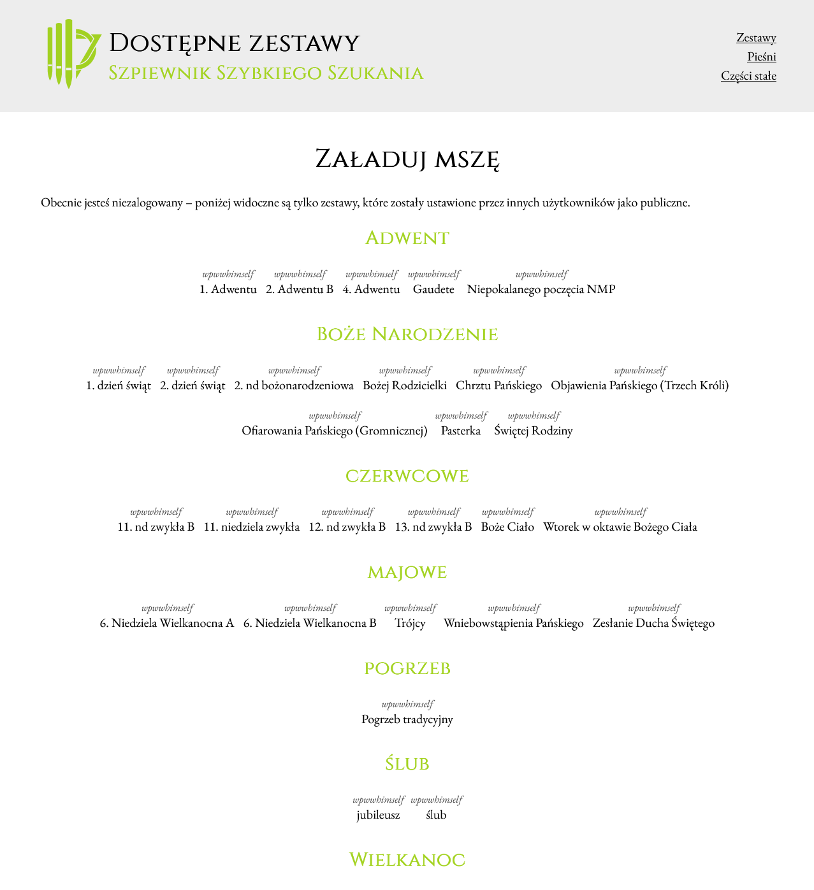
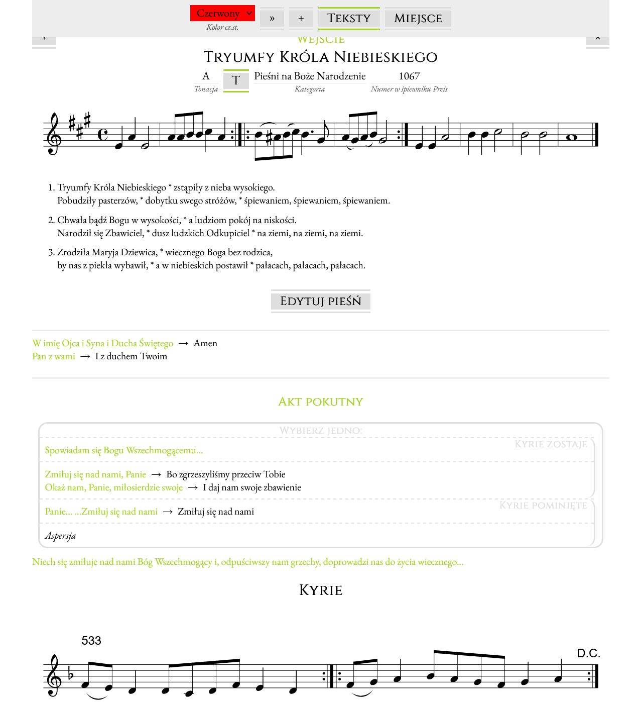
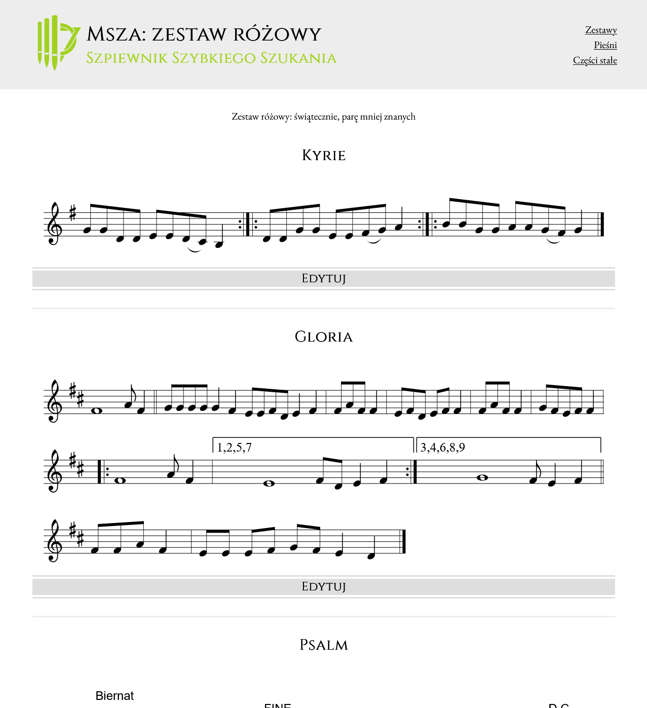
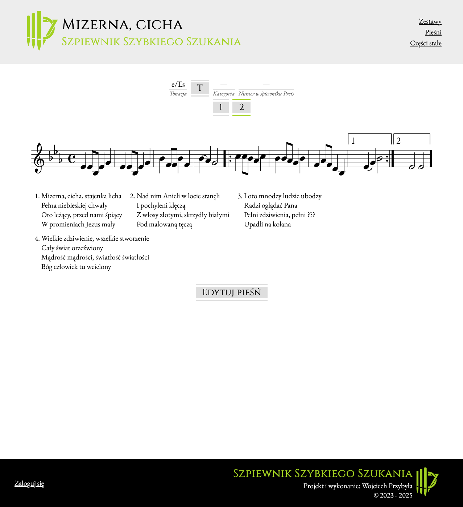

The "Fongbook for Fast Finding" is a third reimagining of my previous app **Projekt Organista**, which is designed to help the organist manage songs and psalms 📜 played during service ✝️ It helps organize the mass and lays out all necessary information in one place 💊

The original app was created in **React**, which in the version you are beholding now has been expanded with the help of **Laravel**. It was created after I realised that the Word document I was maintaining over my first year as an organist has gotten quite bloated and difficult to use.

## Features
The website is capable of multiple handy things, including:
- 🧱 building and displaying reusable mass sets
- ⚡ quick navigation between mass elements
- 📖 managing songs and ordinarium
- 🎵 ABC-powered sheet music preview
- 📱 full responsiveness
- 💨 personalisation of mass formulas on the fly

## Links

This app is available at http://sz3.wpww.pl/. Most of the sets are available for the anonymous user but you are free to quickly create an account to see more of the backend.

## Screenshots

